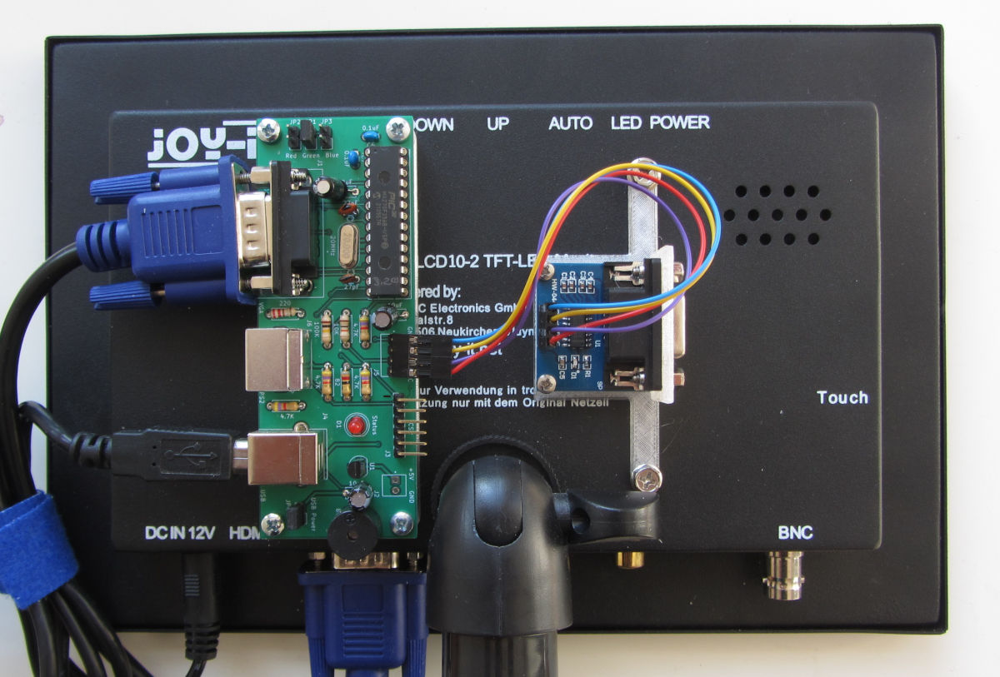

# Geoff's VT100 Terminal

DIY kit including parts and PCB is available on [Tindie](https://www.tindie.com/products/petrohi/geoffs-vt100-terminal-kit/).

## Use PICKit4 to flash the PIC32

## Use a Raspberry Pi to flash the PIC32

### How to program a PIC Microcontroller using a Raspberry Pi or Orange Pi

* [Pickle](https://www.pedalpc.com/blog/program-pic-raspberry-pi/)
* [Raspberry Pi Setup](https://wiki.kewl.org/dokuwiki/boards:rpi)

**********************

## Some useful info

My PIC-terminal is mounted on the back of a small 10" TFT monitor using the Vesa mounting points. 3D printer model files are in the case directory.

The RS-232C connection is interfaced with a cheap TTL-RS232C converter. It protects the PIC pins against +/- 12V. The Rx pint has a voltage divider but the Tx pin doesn't, and signal reversal is very common with RS-232 connections. The "Signal levels" setting is set to TTL.

### How to compile the project

* Download, untar and run the "MPLAB X IDE" installer from MicroChip, I have version 6.20.
  Only the xc32 compiler is required. Make a note of the xc32 version. I have v4.35.

* Download and untar the pic32 peripherial library:
  Run this file, and make sure the install path matched that of the IDE. For me the path is /opt/microchip/xc32/v4.35/ (Linux only).

The MPLAB X IDE is based on the NetBeans IDE.

